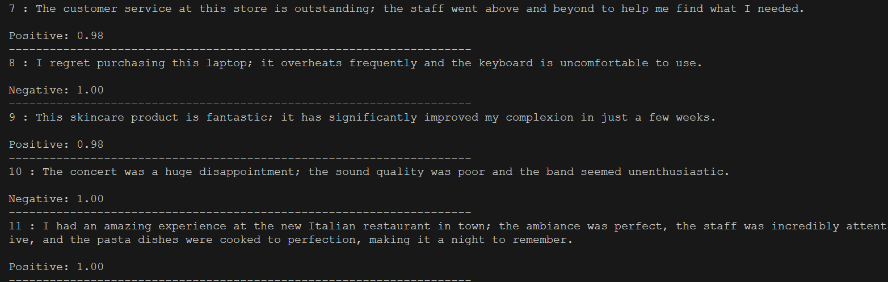

# Film Reviews Sentiment Analysis
 


<!-- PROJECT LOGO -->
<br />
<div align="center">
  <h1 align="center">Reviews Sentiment Analysis</h1>
</div>

<!-- ABOUT THE PROJECT -->
## About The Project

This project implements a Long Short-Term Memory (LSTM) neural network for sentiment analysis on textual reviews. Sentiment analysis, also known as opinion mining, is the process of determining the emotional tone behind a series of words, used to gain an understanding of the attitudes, opinions, and emotions expressed within an online mention.



In this project, we leverage the power of LSTM networks, a type of recurrent neural network (RNN), which are well-suited to classifying, processing, and making predictions based on sequential data. LSTMs are particularly effective for this task due to their ability to maintain long-term dependencies and handle the vanishing gradient problem common in traditional RNNs.

The primary goal of this model is to classify reviews as positive or negative, helping businesses and individuals understand customer feedback and opinions more efficiently and accurately.

Our model use dataset of IMDB movie reviews: [IMDB Dataset](https://www.kaggle.com/datasets/yasserh/imdb-movie-ratings-sentiment-analysis)

Accuracy: ~90%

## Features 

- **Data Preprocessing:**
  - Raw data reading. 
  - Tokenization.
  - Removal of stopwords.
  - Padding and sequence transformation to prepare text data for model training.
  - Data split into 80% for training and 20% for testing.

- **Model Architecture:**
  - Word embeddings.
  - Sequential data passed into a deep LSTM network.
  - Model classifies input into two labels: positive and negative.

- **Training and Evaluation:**
  - Training with custom configurations.
  - Performance evaluation on test datasets.

## Installation

1. Clone the repository
   ```sh
   git clone https://github.com/trungmac07/Face_Aging.git
   ```
2. Install related packages
    ```sh
    pip install -r requirements.txt
    ```

## Usage
1. Arguments
```sh
   python.exe Reviews_Sentiment.py -h
```

2. Test
```sh
   python.exe Reviews_Sentiment.py --mode test --model_path path/to/model.pth --test_path path/to/test_data.txt 
```
Each line of input files contains a sentence of review. List of files is allowed

3. Train
```sh
python.exe Reviews_Sentiment.py --mode train --embedding_path ./glove/glove.6B.50d.txt --stopwords_path ./stopwords --data_dir "./data/IMDB Dataset.csv" --start_step 0 --num_steps 10 --batch_size 32 --model_save_step 5
```


